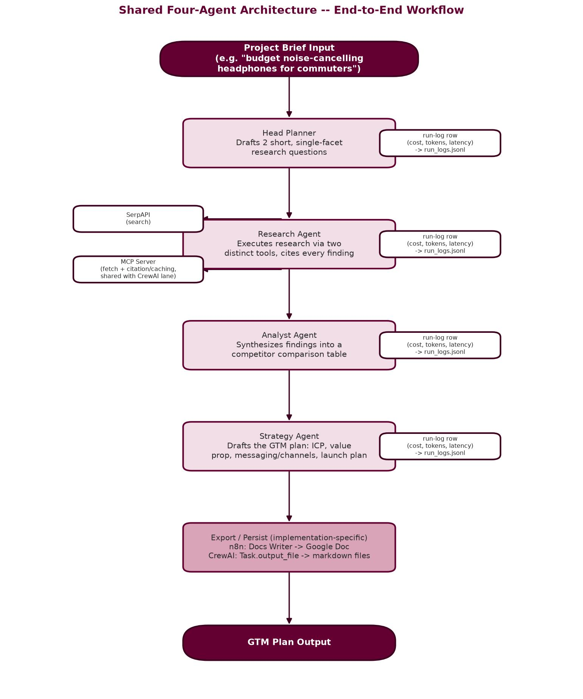
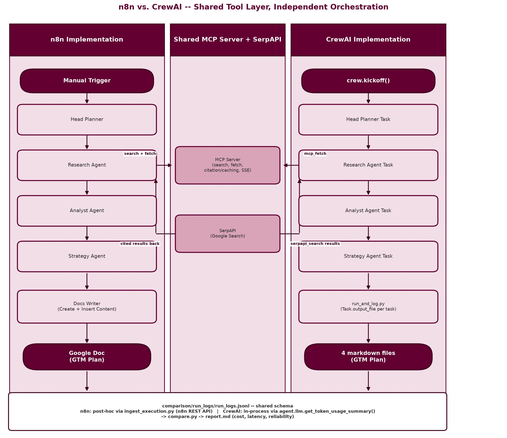

# Multi-Agent Market Research & GTM Planning (n8n, MCP, CrewAI)

##### VT_AGI: Capstone -- Product Strategy Simulation | Brock Frary | Published: 2026-08-01 | Updated: 2026-08-06

A startup's project brief goes in; a founder-ready go-to-market plan comes out -- produced twice, in parallel, by two independent four-agent implementations (n8n and CrewAI) that both drive the same Head Planner, Research Agent, Analyst Agent, and Strategy Agent through a shared MCP tool server and SerpAPI, so the two platforms can be compared head-to-head on cost, latency, and reliability across 15 real logged runs.


---

## Primary Project Artifact

### [Reflection: Multi-Agent Market Research & GTM Planning](./reflection.pdf)

---

*Virginia Tech Applied Agentic AI Post-Graduate Program — Capstone Project (Product Strategy Simulation)*

> **Status:** ✅ Project complete (environment setup, MCP server, n8n implementation, CrewAI implementation, testing, the n8n-vs-CrewAI comparison, and documentation/submission packaging), plus a full rubric audit confirming every requirement is genuinely met against real project files. Both implementations run end-to-end against the same fixed test brief with real cost/latency/reliability data (`comparison/report.md`): n8n averages **$0.0642**/run and **1m 59.4s**/run; CrewAI averages **$0.1379**/run and **6m 39.0s**/run — both comfortably under the $0.50/run budget cap and 100% reliable across 15 logged runs. Human rubric review: both implementations avg **4.33/5**. All deliverables present (see Deliverables below); the reflection document's Personal Reflections section still needs the author's own review before final submission. This README is the north-star spec for the project.
>
> **Reflection Document:** [reflection.pdf](reflection.pdf) · **Full Build History:** [ROADMAP.md](ROADMAP.md)

## Overview

This capstone project designs and implements a **multi-agent workflow** that automates market research and go-to-market (GTM) planning. The same agent design is built **twice** — once in **n8n** and once in **CrewAI** — so the two implementations can be compared on cost, latency, and reliability.

Four agents, shared across both implementations:

| Agent | Role |
|---|---|
| **Head Planner** | Orchestrator and documenter |
| **Research Agent** | Finder — desk research, sourcing |
| **Analyst Agent** | Sense-maker — competitor analysis, synthesis |
| **Strategy Agent** | Planner — drafts the GTM plan |

The workflow orchestrates desk research → competitor analysis → GTM plan drafting → export to Google Docs.

## Why this project (Situation)

Product teams spend days manually collecting sources, analyzing competitors, and drafting GTM documents. That process is:

- **Slow** — delays responsiveness to market shifts
- **Error-prone** — manual effort misses insights
- **Inconsistent** — not reproducible across research cycles

## Success Criteria — North Star KPIs

Every design and implementation decision in this repo is measured against these. Source of truth: `documentation/1762856365_capstoneprojectproblemstatement.md`.

| KPI | Target |
|---|---|
| Coverage | ≥90% of research questions answered with linked sources |
| Source quality | ≥80% citations from top-tier/primary sources; 0% broken links |
| Latency | <15 minutes from project brief to drafted GTM document — **confirmed with real data** (`comparison/report.md`, Phase 5): n8n avg **1m 59.4s**/run, CrewAI avg **6m 39.0s**/run, both well within budget across all 15 logged runs. |
| Strategy quality | Human rubric score ≥4/5 (clarity, feasibility, differentiation) — **confirmed with real data** (Phase 4): both n8n and CrewAI scored **avg 4.33/5**, each strongest on a different criterion (n8n on differentiation, CrewAI on feasibility). |
| Reproducibility | ≥80% consistent facts across multiple runs — **confirmed with real data** (Phase 4, 3 reruns per implementation on the primary brief): both implementations were 100% consistent on the core target-customer theme; specific details (age bracket, exact competitor list) varied run to run, normal LLM behavior rather than a system failure, including a disclosed n8n competitor-data-capture asymmetry. |
| Cost efficiency | Cloud/API spend per run within budget cap — **$0.50 per end-to-end run, per implementation** (tightened from an original $1.00 proposal once real data existed); **confirmed with real data across 15 logged runs** (`comparison/report.md`, Phase 5): n8n avg **$0.0642**/run (6 runs, range $0.0426-$0.1104, all well under the cap), CrewAI avg **$0.1379**/run (9 runs, range $0.0843-$0.2156, all well under the cap) — both pass comfortably, with n8n roughly 2.1x cheaper on average. **Known n8n platform limitation affecting real-time measurement of this KPI:** n8n's AI Agent node does not expose per-agent token usage to downstream nodes ([n8n-io/n8n#26302](https://github.com/n8n-io/n8n/issues/26302)), solved instead with a post-hoc ingestion script (`ingest_execution.py`, see below). |

## Architecture

Both implementations wire the same four agents to a shared tool layer:

```
Trigger → Head Planner → Research Agent → Analyst Agent → Strategy Agent → Docs Writer
                              │                │
                         MCP tools         SerpAPI (search)
```

- **MCP server** exposes research tools (search, fetch/snapshot, citation tracking) consumed by both n8n and CrewAI.
- **SerpAPI** supplies web search results to the Research Agent.
- **Docs Writer** exports the final GTM plan to Google Docs (PDF export optional).
- **Logging, retries, and cost/latency tracking** are cross-cutting concerns in both implementations -- `log_server` (below) is the shared persistence mechanism both write to.

**Figure A -- Shared Four-Agent Workflow**



The full pipeline from project brief through Head Planner, Research Agent (with its two tool integrations), Analyst Agent, and Strategy Agent, to the implementation-specific export/persist step. Every agent writes a run-log row (cost, tokens, latency) to the shared `comparison/run_logs/run_logs.jsonl` schema, regardless of which implementation produced it.

**Figure B -- n8n vs. CrewAI Swimlane**



The same system as three lanes: n8n's orchestration, CrewAI's orchestration, and the shared MCP Server + SerpAPI tool layer both Research Agent stages call into independently. Both lanes terminate in a different artifact (a Google Doc vs. four markdown files) but converge on the same run-log schema at the bottom, which is what makes an apples-to-apples cost/latency comparison possible at all.

### MCP server: why we built one, and what it does

The assignment requires starting an MCP server and connecting both implementations to it, but doesn't require writing one from scratch. Rather than build blind (first time working with MCP) or gamble on an unverified off-the-shelf bundle, we adapted the official reference `fetch` server from `modelcontextprotocol/servers` and extended it -- the lowest-cost path that still teaches real MCP mechanics through a working example.

**What it accomplishes:**
- **`search`** -- queries SerpAPI and returns cited results (title, link, snippet, citation ID) for the Research Agent.
- **`fetch`** -- fetches a URL, respects `robots.txt`, converts the page to markdown, and returns a cited, timestamped snapshot.
- **Citation/caching layer** -- every `search` and `fetch` result is written to a local, timestamped, citation-ID-keyed snapshot, so repeated lookups within a freshness window reuse the snapshot instead of re-fetching (the source-volatility mitigation from the Risks table below). This file I/O lives in the MCP server because n8n can't own it directly (its Code node sandboxes `fs`, and Write to File needs binary input, not text).
- **Real MCP protocol over SSE** -- not a generic REST wrapper. n8n's native MCP Client Tool node and CrewAI's `MCPServerAdapter` both connect to the same running server over SSE, exactly matching the shared-tool-layer architecture diagrammed above.

**Steps taken:**
1. Scaffolded `mcp-server/` as its own `uv` project (consistent with the CrewAI project's planned uv structure).
2. Added the reference `fetch` server's own dependencies (`mcp`, `markdownify`, `protego`, `readabilipy`, `pydantic`, `requests`) rather than reinventing HTML-to-markdown conversion or robots.txt parsing.
3. Wrote the custom `search` tool and the citation/caching layer alongside the adapted `fetch` tool, all served from one `MCPServer` instance over SSE (`mcp_server.run(transport="sse")`).
4. Added a `pytest` suite (mocked HTTP responses, no live network needed) covering the cache, search, and fetch logic.
5. Smoke-tested every tool for real: ran the server, then used `curl` to drive the full MCP protocol by hand (`initialize` handshake, `tools/list`, `tools/call` for both tools) and confirmed cited, timestamped results came back correctly, including a cache hit on a repeated `fetch`.

See `SETUP.md` for the exact commands (run, curl smoke-test sequence) and a note on a Node.js-related extraction-quality tradeoff inside the `fetch` tool.

### log_server: why we built one, and what it does

The rubric explicitly requires "logging, retries, and cost/latency tracking" plus a documented n8n-vs-CrewAI comparison -- both need real per-run data persisted somewhere Phase 5's `compare.py` can read. n8n can't write that data itself: its Code node sandboxes `fs`, and two 2026 CVEs (CVE-2026-1470, CVE-2026-0863) in n8n's sandbox-escape surface, specifically around Code-node file/code execution, make routing around that sandbox the wrong move rather than just an inconvenience. Same problem shape as the MCP server above, same solution: a small standalone Python process n8n talks to instead of trying to own the file I/O itself.

**What it accomplishes:**
- **`POST /log`** -- validates one JSON row against the shared run-log schema (`run_id, implementation, agent, timestamp, tokens_in, tokens_out, cost_usd, latency_ms, run_status`) and appends it as one line to `comparison/run_logs/run_logs.jsonl`.
- **Shared, not n8n-only** -- the same file and schema the future CrewAI implementation will also write to, so Phase 5's `compare.py` reads both without special-casing either.
- **Zero new dependencies** -- built on Python's standard library `http.server` only; no framework needed for one endpoint that validates and appends a line to a file.

**Steps taken:**
1. Scaffolded `comparison/log_server/` as its own `uv` project, matching `mcp-server/`'s structure exactly.
2. Wrote schema validation (`run_log.py`) and the HTTP handler (`server.py`) separately, so validation logic is testable without a real server.
3. Added a `pytest` suite (18 tests) -- schema-validation edge cases plus a real `ThreadingHTTPServer` instance driven over a real local socket in tests, no mocking needed for either.
4. Started the server for real and confirmed it live with an actual `POST` (`HTTP 201`), then deleted that one test row so the log file starts empty for real data.

**Real per-agent cost/latency data, not real-time from n8n:** n8n's AI Agent node doesn't expose token usage to downstream nodes ([n8n-io/n8n#26302](https://github.com/n8n-io/n8n/issues/26302)), so an in-workflow HTTP Request node can't log it directly. `ingest_execution.py` (a second entry point in the same project) solves this by calling n8n's own REST API after a run completes -- which does have the real data -- and cross-referencing it against the exported workflow JSON to attribute each Chat Model's token usage to the right agent. Confirmed against a real full-chain execution: **$0.1104 total cost**, with real `tokens_in`/`tokens_out`/`latency_ms` per agent. See `SETUP.md` for run commands.

## Repository structure

```
.
├── ROADMAP.md              # Full build history: every phase, design decision, bug, and fix, as it happened
├── diagrams/                # Architecture diagrams (workflow + n8n-vs-CrewAI swimlane), embedded above
├── mcp-server/             # Shared MCP server: research tools used by both n8n and CrewAI
│   └── tests/              # pytest: search/fetch/cache, mocked I/O
├── n8n/                    # Exported n8n workflow: VT Capstone GTM Planner.json + setup notes (no Python here)
├── crewai/                 # CrewAI project: JSON-first scaffold (crewai create crew), built and proven
│   ├── agents/*.jsonc      # Head Planner, Research, Analyst, Strategy agent definitions
│   ├── crew.jsonc          # crew config + task definitions (sequential process)
│   ├── tools/              # custom tools: serpapi_search.py, mcp_fetch.py
│   ├── run_and_log.py      # runs the crew + appends run-log rows (bypasses crewai run's TUI)
│   └── tests/              # pytest: custom tools, mocked I/O
├── comparison/
│   ├── compare.py          # reads run_logs/, computes cost/latency/reliability stats (built, tested)
│   ├── report.md           # generated comparison writeup (output of compare.py)
│   ├── tests/               # pytest: compare.py's grouping/aggregation logic
│   ├── log_server/         # uv project: POST /log HTTP endpoint, appends run-log rows (built, tested)
│   └── run_logs/           # run_logs.jsonl from both implementations, shared schema (git-ignored)
├── outputs/                # Sample GTM plan outputs, one per implementation
│   ├── sample_gtm_plan_n8n.md    # Real Google Doc content, n8n's Docs Writer output
│   └── sample_crewai_run/        # Real per-task markdown, CrewAI's Task.output_file persistence
└── screenshots/            # Build-walkthrough screenshots, named <Phase>-<NN>-name.jpg -- see SCREENSHOTS.md for what each one proves
```

*(`documentation/` -- the assignment's own rubric/problem-statement text -- and a few other local-only files
stay git-ignored; see `.gitignore` for the full list. Everything that documents this project's own work is
public.)*

*(Every Python component has its own `tests/` directory rather than one top-level `tests/` folder, since each
component -- `mcp-server/`, `crewai/`, `comparison/log_server/`, `comparison/` -- is its own independently
runnable/testable unit.)*

**Python approach:** fully modular `.py` throughout. The CrewAI project follows CrewAI's own uv scaffold, the MCP server is a plain long-running Python process, and even the n8n-vs-CrewAI comparison (`comparison/compare.py`) is a script rather than a notebook, so every part of the system is pytest-testable and reproducible with a single command. Both implementations write run-log rows to a shared schema (`run_id, implementation, agent, timestamp, tokens_in, tokens_out, cost_usd, latency_ms, run_status`) in `comparison/run_logs/`, so `compare.py` can read both without special-casing either implementation.

## Prerequisites

- **Dev environment:** WSL2, Ubuntu 24.04.4 LTS (local, no separate VM)
- **n8n:** v2.27.4, run locally in WSL
- Python 3.11+ and `uv`
- An MCP server for research tools — adapting an existing/reference implementation rather than building one from scratch (first time working with MCP servers)
- SerpAPI key — obtained (free tier, 250 lookups/month), in `.env`
- Google account for Docs export: a personal Google account, OAuth user-consent flow (both n8n and CrewAI run locally, so no service account needed) — Google Cloud project created, Docs + Drive APIs enabled, OAuth consent screen and Client ID configured; Client ID/Secret in `.env`. Account details kept out of documentation.
- **LLM provider:** OpenAI `gpt-5` as the default model for both implementations. Anthropic Claude (e.g. Haiku 4.5) is an optional later comparison once the baseline works, not required for the MVP.

See `SETUP.md` for the full as-verified toolchain: exact versions, install locations, and the install/version/test command for each (Python, `uv`, `nvm`, Node.js, npm, n8n), plus the WSL networking fixes that were needed to get reliable internet access working.

## Deliverables

- [x] Exported n8n workflow JSON file
- [x] CrewAI project files (uv structure)
- [x] Sample Google Doc output of a GTM plan -- `outputs/sample_gtm_plan_n8n.md` (real content transcribed from the actual Google Doc produced in Phase 2.3, `screenshots/Phase2-08`; the live Doc itself stays in the author's personal Google Drive). CrewAI's equivalent -- real, per-task persisted output via `Task.output_file` -- is `outputs/sample_crewai_run/`.
- [x] CrewAI chatbot screenshots (CLI-based demo, `run_and_log.py`'s terminal output -- see `screenshots/Phase3-01` through `08`, `SCREENSHOTS.md`)
- [x] Documentation (README) covering architecture, setup, testing notes, and n8n-vs-CrewAI comparison -- see Architecture, Prerequisites (-> `SETUP.md`), Testing strategy below, and the real comparison data in the KPI table above (`comparison/report.md`)
- [x] Reflection document (`.docx`/`.pdf`) -- VT AGI program-wide submission requirement, not part of this project's own rubric; built locally, not published to GitHub (`reflection/` is git-ignored)

## Testing strategy

- **Unit tests** — mock inputs/outputs for tools (SerpAPI, MCP, Docs)
- **Scenario tests** — fixed project briefs with golden expected outputs
- **Human review** — strategy quality scored against the rubric (clarity, feasibility, differentiation)
- **Comparison** — cost, latency, and reliability measured across both implementations

## Risks & Mitigations

| Risk | Mitigation |
|---|---|
| Source volatility | Cache results, store page snapshots, include timestamps. **Encountered live** (robots.txt/403 blocks during fetch) and mitigated with a fetch-failure fallback, proven working twice in real runs. |
| API rate limits | **As actually implemented:** n8n's "Retry On Fail" on the two Docs Writer nodes uses a single fixed wait (not exponential backoff), and a real transient SerpAPI timeout during Phase 4 testing recovered via the agent's own reasoning loop retrying with a reworded query, not a coded backoff mechanism. No batching or multiple-key rotation is implemented — single-key, low-volume academic-scope usage never hit a real rate limit in this project. |
| Hallucinations | Evidence IDs are real (`citation_id`, `url`, `fetched_at` on every MCP `search`/`fetch` result). "Flag uncited claims" is a prompt-level instruction (agents are told to cite findings), not a separate automated detection/flagging mechanism — no code inspects output for uncited claims. |
| Formatting drift | No Google Docs template file is used — Docs Writer creates a blank document then inserts text via a fixed Create → Insert Text operation sequence, which is consistent but isn't a "template" in the traditional sense. No automated post-write validation exists; the one real check performed was a manual visual confirmation of the final document (`Phase2-08` screenshot). |
| Cost overruns | Token/iteration limits are real and explicit on both implementations' research-capable agents (n8n `maxIterations: 5`; CrewAI `max_iter: 25`, sized to the framework default rather than a lower number after confirming real runs use up to ~18-20 tool-call iterations). Budget caps are real, confirmed with data (**$0.50/run** cap, both implementations well under it — see Cost efficiency KPI above). "Early summarization" isn't a distinct implemented technique beyond agents being prompted to keep outputs concise. |

## Documentation

Full rubric and grading criteria: `documentation/1762856365_capstoneprojectproblemstatement.md` (local only — `documentation/` is git-ignored, not published to GitHub)
Assignment brief: `documentation/Multi- Agent Market Research and GTM Planning (n8n, MCP, and CrewAI).md` (local only)
Screenshot index: [`SCREENSHOTS.md`](SCREENSHOTS.md) — what each screenshot in `screenshots/` proves, with real error messages, token counts, and costs
Full build history: [`ROADMAP.md`](ROADMAP.md) — every phase, design decision, bug hit, and fix, documented as it happened

---

> © 2026 Brock Frary. All rights reserved.

